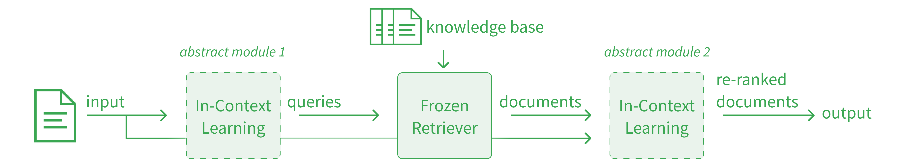

<p align="center">
  
</p>
<p align="left">

## Infer-Retrieve-Rank: In-Context Learning for Extreme Multi-Label classification

Resources:
1. [Jan'23] [X thread](https://twitter.com/KarelDoostrlnck/status/1749866526117908634)
1. [Jan'23] [In-Context Learning for Extreme Multi-Label classification](https://arxiv.org/pdf/2401.12178.pdf) paper

----
**Infer-Retrieve-Rank** (IReRa) is a generic and modular *program* which specifies interactions between pretrained Language Models and Retrievers to efficiently solve multi-label classification tasks with an extreme amount of classes (≥10,000 classes). Using only ≅ 50 labeled input examples, IReRa can be *optimized* to achieve state-of-the-art performance, despite not being finetuned. This optimization generally involves having a strong, teacher Language Model (e.g. gpt4) solve the task and gather instructions or demonstrations that help a more efficient, student Language Model (e.g. llama-2) solve the task better. A user can easily specify which parts of the program are implemented using which LMs, to strike the perfect balance between cost and performance. 

The goal of IReRa is to easily be applicable to a broad range of tasks involving inference with Language Models and Retrieval. To this end, this repository detangles (i) the logic of Infer-Retrieve-Rank, (ii) the prompts needed to adapt IReRa to a specific domain and (iii) optimization techniques to improve performance. All of this is made possible through the [dspy](www.dspy.ai) programming model.

LM calls of our results are cached, meaning you can reproduce our runs without paying for any inference costs yourself.

### Table of Contents

1. **[Installation](#1-installation)**
1. **[Load data](#2-load-data)**
1. **[Compile and run](#3-compile-and-run)**
1. **[Apply to new tasks](#4-apply-to-new-tasks)**
1. **[Writing custom programs](#5-writing-custom-programs)**
1. **[Contributing](#6-contributing)**
1. **[Citation](#7-citation)**

## 1) Installation

Create the conda environment: 

    conda create -n xmc python=3.10
    conda activate xmc

Install DSPy. Our work relies on an experimental branch of DSPy.

    git clone -b irera --single-branch https://github.com/stanfordnlp/dspy.git
    pip install ./dspy

Install the rest of the requirements:

    pip install -r requirements.txt


## 2) Load data
Load the data. Optionally load a cache so can run our code without actually paying any inference costs.

    bash scripts/load_data.sh


## 3) Compile and run

All compilation IReRa runs from our paper can be reproduced by running `bash scripts/run_left_to_right.sh`. We provide the resulting program state in `results_precompiled/` so you can load our compiled IReRa programs. 

Set your OpenAI API KEY:

    export OPENIA_API_KEY=<your-key>

Load our compiled IReRa for ESCO_TECH and evaluate:

    python run_irera.py \
        --dataset_name esco_tech \
        --state_path ./results_precompiled/esco_tech_infer-retrieve-rank_00/program_state.json \
        --lm_config_path ./lm_config.json \
        --do_validation \
        --do_test 

Compile your own IReRa on ESCO_TECH and evaluate:

    python compile_irera.py \
        --dataset_name esco_tech \
        --ontology_name esco \
        --prior_path ./data/esco/esco_priors.json \
        --ontology_path ./data/esco/skills_en_label.txt \
        --infer_signature_name infer_esco \
        --rank_signature_name rank_esco \
        --retriever_model_name sentence-transformers/all-mpnet-base-v2 \
        --infer_student_model_name llama-2-13b-chat \
        --infer_teacher_model_name gpt-3.5-turbo-instruct \
        --rank_student_model_name gpt-4-1106-preview \
        --rank_teacher_model_name gpt-4-1106-preview \
        --infer_compile_metric_name rp10 \
        --rank_compile_metric_name rp10 \
        --prior_A 0 \
        --rank_topk 50 \
        --do_validation \
        --do_test \
        --optimizer_name left-to-right \
        --lm_config_path ./lm_config.json 

Command line arguments are explained in the respective files. 

The results from `run_irera.py` are slightly different than those of `compile_irera.py`, most likely due to a minor bug in loading and saving models. We take the results of `compile_irera.py` as the official results we report in the paper.


## 4) Apply to new tasks
To apply IReRa to a new task, you minimally need to add a new dataset and write a custom signature

### A) Adding a new dataset
Data loading logic is defined in `src/data_loaders`. Every loader should minimally return a validation and testing dataframe, where each row has a `'text'` field (which is a `string`) and a `'label'` field (which is a `list` of `strings`).

`compile_irera` expects a `.txt` file where each line is a label, via the `--ontology_path` argument. These labels can not contain commas, since this currently breaks embedding the labels in a comma-separated list. Make sure labels have no trailing spaces. Via `--prior_path` a dictionary needs to be supplied which maps labels to probabilities.

### B) Writing custom signatures
A signature tells an in-context learning module what its task is and what the inputs and outputs look like. You can think of it as a minimal zero-shot prompt for the task. All signatures are defined in `src/programs/signatures.py`, add your new signature here.

To add a new signature, simple subclass `dspy.Signature` with your custom fields and description. Add your new class to the `supported_signatures` dictionary at the bottom of `src/programs/signatures.py` so it can be accessed throughout the code.

### C) Adding new metrics
Raw metrics are defined in `src/metrics.py` and are wrapped with DSPy logic in `src/evaluators.py`. When adding a metric, make sure to add it to the `supported_metrics` dictionary at the bottom of `src/evaluators.py` so it can be used throughout the code.

## 5) Writing custom programs
The goal of IReRa is to be modular and easily applicable to new tasks. To alter IReRA, you minimally need to [write custom logic]() for (new) modules [write custom optimizers]() which bootstrap your program.


### A) Writing custom logic
Infer-Retrieve-Rank is defined in `src/programs/infer_retrieve_rank.py`. It is initialized with a config, defined in `src/programs/config.py`. You can write new programs or manipulate the behavior of IReRa by changing the python code in the `forward` method.

When you introduce new hyperparameters, make sure to add these to the config you are using. Otherwise these will not be saved and loaded.

### B) Writing custom optimizers
Optimization strategies are defined in `src/optimizer.py`. When adding a new optimizer, make sure to add it to the `supported_optimizers` dictionary at the bottom of the file, so it can be accessed throughout the code.

Currently, optimizers are aware of which modules the to-optimize program has. This needs to be resolved so optimization strategies can be flexibly applied to different programs.


## 6) Contributing
I am happy to take on collaborations! Feel free to contact me at the email defined in the paper, or by opening an issue or pull request on the GitHub page. Here are some issues we could work on:

Research:
- [ ] Incorporate label definitions, synonyms, and hierarchy to improve performance
- [ ] Applying IReRa as recommender systems (The [Extreme Classification Repository](http://manikvarma.org/downloads/XC/XMLRepository.html) has many such tasks)
- [ ] Add ensembling strategies to IReRa to improve performance (both ensembling programs and ensembling different modules within those programs)
- [ ] Add chunking / summarization strategies to deal with long inputs efficiently
- [ ] Optimize different parts of the program for different metrics to improve end-to-end performance (e.g. optimize Infer-Retrieve for high Recall@50 and use Rank to improve Recall@10)
- [ ] Figure out how to use best use labels for program output to bootstrap supervision on intermediate program steps for better optimization
- [ ] Automatically pick the best LMs / retrievers from HuggingFace to implement a given module (AutoIReRa)

Software Engineering:
- [ ] Add a HugginFace dataloader to apply IReRa to any multi-label classification task
- [ ] Add a cli argument parsing class
- [ ] Create a config for the Optimizer class
- [ ] Make the Optimizer class agnostic of the implementation details of the program that gets optimized, so it can define a high-level strategy which gets compiled across many programs
- [ ] Track amount of student and teacher calls during optimization so system-cost can be compared.
- [ ] Make `src/programs/retrieve.py` more efficient
- [ ] Track intermediate pipeline steps and log these traces for debugging
- [ ] Use logging instead of print-statements, and dump logs to experiment file
- [ ] Add RAG(atouille)
- [ ] Make sure you can rerun out cached results without providing an API_KEY


----
## 7) Citation

Get notified of future work by following [@KarelDoostrlnck](https://twitter.com/KarelDoostrlnck) on Twitter.

If you found this repo useful or use **Infer-Retrieve-Rank** in your work, please cite us:

```
@article{d2024context,
  title={In-Context Learning for Extreme Multi-Label Classification},
  author={D'Oosterlinck, Karel and Khattab, Omar and Remy, Fran{\c{c}}ois and Demeester, Thomas and Develder, Chris and Potts, Christopher},
  journal={arXiv preprint arXiv:2401.12178},
  year={2024}
}
```